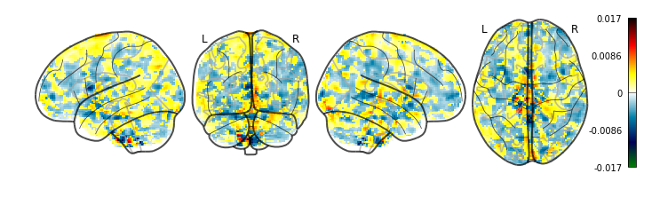

```{r setup, include=FALSE}
knitr::opts_chunk$set(echo = TRUE, message = FALSE, warning = FALSE, fig.path = "figs/", dpi = 300, colormodel = "cmyk", cache = FALSE)
options(scipen = 999)
```

# load packages
```{r}
library(pacman)
pacman::p_load(tidyverse, brms, ggeffects, tidybayes, ROCR, caret, interactions, install = TRUE)
devtools::install_github("hadley/emo")
```

# define aesthetics
```{r}
palette = c("#e64626", "#1985a1", "#4c5c68", "#FAC748")
palette_group = c(palette[2], palette[4])

plot_aes = theme_minimal() +
  theme(legend.position = "top",
        legend.text = element_text(size = 12),
        text = element_text(size = 16, family = "Futura Medium"),
        panel.grid.major = element_blank(),
        panel.grid.minor = element_blank(),
        axis.text = element_text(color = "black"),
        axis.line = element_line(colour = "black"),
        axis.ticks.y = element_blank())
```

# define functions
```{r}
make_table = function(data) {
    data %>%
      broom.mixed::tidy(conf.int = TRUE) %>%
      filter(effect == "fixed") %>%
      mutate(term = gsub("\\(Intercept\\)", "intercept", term),
             term = gsub("trial_condregulation", "trial condition (regulation)", term),
             term = gsub("trial_cond_recode", "trial condition (regulation)", term),
             term = gsub("dot_between_std_noc", "signature expression (between)", term),
             term = gsub("dot_within_std", "signature expression (within)", term),
             term = gsub("dot_sd", "signature expression variability", term),
             term = gsub("dist_expression_std", "signature expression modulation", term),
             term = gsub("mean_expression", "mean signature expression", term),
             term = gsub("regulation_expression", "signature expression (mindfulness)", term),
             term = gsub("reactivity_expression", "signature expression (reactivity)", term),
             term = gsub("active_weekon", "intervention week (on)", term),
             term = gsub("time_of_daymorning", "time of day (morning)", term),
             term = gsub("signal_count", "signal", term),
             term = gsub("SocialWeekendWeekend", "weekend", term),
             term = gsub("gender_f", "gender (female)", term),
             term = gsub(":", " x  ", term),
             `b [95% CI]` = sprintf("%.2f [%.2f, %.2f]", estimate, conf.low, conf.high),) %>%
      select(term, `b [95% CI]`) %>%
      knitr::kable(digits = 2)
}
```

# load and tidy data {.tabset}
* remove trials missing stimulus information
  * the following participants had technical errors during all mindfulness trials: sub-MURIP012, sub-MURIP063, sub-MURIP078
* remove trials in which the mean signal intensity of the brain map is +/- 3 SDs from the mean

## task
```{r}
task_data = read.csv("../data/task/cuereact_all062920.csv", stringsAsFactors = FALSE) %>%
  filter(grepl("rating", trial_type)) %>%
  select(pID, block_num, trial_num, trial_type, resp, rt, stim) %>%
  mutate(trial_cond = ifelse(grepl("friend3|friend4", trial_type), "regulation",
                      ifelse(grepl("friend1|friend2", trial_type), "up-regulation",
                      ifelse(grepl("mindful", trial_type), "regulation",
                      ifelse(grepl("nonalc", trial_type), "non-alcohol reactivity",
                      ifelse(grepl("rating_alc_react", trial_type), "reactivity", NA))))),
         trial_cond = factor(trial_cond, levels = c("non-alcohol reactivity", "reactivity", "regulation", "up-regulation"))) %>%
  rename("stimulus" = stim) %>%
  filter(!is.na(stimulus))

task_conditions = task_data %>%
  select(pID, trial_type) %>%
  unique() %>%
  filter(grepl("friend|mindful", trial_type) | pID %in% c("sub-MURIP012", "sub-MURIP063", "sub-MURIP078")) %>%
  mutate(condition = ifelse(grepl("friend", trial_type), "perspective", "mindfulness")) %>%
  select(-trial_type) %>%
  unique()

task_data_all = task_data %>%
  left_join(., task_conditions) %>%
  mutate(condition = ifelse(is.na(condition), "control", condition),
         trial_cond = factor(trial_cond, c("non-alcohol reactivity", "reactivity", "regulation", "up-regulation")))

task_mindfulness = task_data_all %>%
  filter(condition == "mindfulness")
```

## dots
```{r}
file_dir = "../data/dots"
file_pattern = "sub.*"
file_list = list.files(file_dir, pattern = file_pattern)

dots_tmp = data.frame()

for (file in file_list) {
  tmp = tryCatch(read.table(file.path(file_dir,file), fill = TRUE, header = TRUE, sep = ",") %>%
                    extract(file, c("pID", "beta"), ".*(sub-MURIC[0-9]{3}|sub-MURIP[0-9]{3})/(beta_[0-9]{4}).nii") %>%
                    mutate(stimulus = as.character(stimulus)), error = function(e) message(file))
  
  dots_tmp = rbind(dots_tmp, tmp)
  rm(tmp)
}

dots = dots_tmp %>%
  left_join(., task_conditions) %>%
  mutate(condition = ifelse(is.na(condition), "control", condition)) %>%
  group_by(condition) %>%
  filter(!stimulus == "nan") %>%
  mutate(sd3_signal = 3 * sd(mean_signal, na.rm = TRUE),
         grand_mean_signal = mean(mean_signal, na.rm = TRUE),
         outlier = ifelse(mean_signal > grand_mean_signal + sd3_signal, 1,
                   ifelse(mean_signal < grand_mean_signal - sd3_signal, 1, 0))) %>%
  select(-sd3_signal, -grand_mean_signal) %>%
  filter(!outlier == 1)
```

## classifier data
```{r}
classifier_data = read.csv("../data/mvpa/logistic_stats.csv", stringsAsFactors = FALSE) %>%
  rename("pID" = subjectID) %>%
    mutate(predicted_factor = ifelse(predicted > .5, "regulate", "react"),
           predicted_factor = as.factor(predicted_factor),
           actual_factor = ifelse(actual == 1, "regulate", "react"),
           actual_factor = as.factor(actual_factor))
```

# merge and prep for modeling
* filter out motion exclusions: sub-MURIC303
* filter out reactivity to non-alcoholic beverage trials
* recode trial condition as regulation = -.5 and reactivity = .5 to test relationship collapsed across conditions
* create disaggregated_mindfulness dataset
  * `dot_within_std` = within-person centered level-1 signature expression variable; standardized across participants
  * `dot_between_std` = grand-mean centered level-2 signature expression variable; standardized across participants

```{r}
merged = task_data_all %>%
  full_join(., dots) %>%
  filter(!pID == "sub-MURIC303") %>%
  filter(trial_cond %in% c("reactivity", "regulation")) %>%
  mutate(trial_cond_recode = ifelse(trial_cond == "regulation", .5, -.5),
         trial_cond = as.factor(as.character(trial_cond)))

between = merged %>%
  select(pID, dot, trial_cond, trial_cond_recode, condition) %>%
  group_by(pID, trial_cond, trial_cond_recode, condition) %>%
  summarize(dot_between = mean(dot, na.rm = TRUE)) %>%
  group_by(condition) %>%
  mutate(sd_dot = sd(dot_between, na.rm = TRUE),
         #dot_between_c = scale(dot_between, scale = FALSE, center = TRUE),
         #dot_between_std = dot_between_c / sd_dot,
         dot_between_std_noc = dot_between / sd_dot) %>%
  select(-sd_dot)

within = merged %>%
  select(pID, block_num, trial_num, dot, condition, trial_cond) %>%
  group_by(pID, condition) %>%
  mutate(dot_within_c = scale(dot, scale = FALSE, center = TRUE)) %>%
  group_by(condition) %>%
  mutate(sd_dot = sd(dot_within_c, na.rm = TRUE),
         dot_within_std = dot_within_c / sd_dot) %>%
  mutate(classifier_accuracy = ifelse(dot > 0 & trial_cond == "regulation", "hit",
                               ifelse(dot < 0 & trial_cond == "reactivity", "correct rejection",
                               ifelse(dot > 0 & trial_cond == "reactivity", "false alarm",
                               ifelse(dot < 0 & trial_cond == "regulation", "miss", NA))))) %>%
  select(-sd_dot)


disaggregated = merged %>%
  left_join(., between, by = c("pID", "condition", "trial_cond", "trial_cond_recode")) %>%
  left_join(., within, by = c("pID", "condition", "trial_num", "block_num", "trial_cond", "dot")) %>%
  filter(trial_cond %in% c("reactivity", "regulation"))

disaggregated_mindfulness = disaggregated %>%
  filter(condition == "mindfulness")

disaggregated_control = disaggregated %>%
  filter(condition == "control")
```

# preregistered hypotheses
## mindfulness signature development analyses

Here is the weight map from the MVPA analyses:




### H1a {.tabset}
> We expect that we will be able to train a classifier at the run level to distinguish mindfulness from uninstructed reactivity to alcohol cues with greater than chance accuracy decoding.

**Results**

`r emo::ji("check")` Average cross-validation decoding accuracy is greater than chance (though there's lot of room for improvement).

#### ROC 
```{r, fig.width=5, fig.height=4.5}
classifier_data %>%
  do({
    condition = .$condition
    pred = prediction(.$predicted, .$actual)
    perf = performance(pred, measure = "tpr", x.measure = "fpr")
    data.frame(cut = perf@alpha.values[[1]],fpr = perf@x.values[[1]],tpr = perf@y.values[[1]])
  }) %>%
  ggplot(aes(fpr, tpr)) +
    geom_line(color = palette[4], size = 1) +
    geom_abline(intercept = 0, slope = 1) +
    scale_x_continuous(breaks = seq(0, 1, .2)) +
    scale_y_continuous(breaks = seq(0, 1, .2)) +
    labs(x = "\nfalse positive rate (1 - specificity)", y = "true positive rate (sensitivity)\n") +
    theme(legend.position = c(.8, .3),
          legend.spacing.y = unit(-.1, "cm")) +
   plot_aes
```

#### confusion matrix

```{r}
caret::confusionMatrix(classifier_data$predicted_factor, classifier_data$actual_factor)
```

## H1b {.tabset}
> Given that the classifier is developed at the run level, we will also confirm that the expression of the mindfulness signature is evident at the trial-level. That is, we expect the signature expression to be higher during mindfulness trials compared to reactivity trials.

**Results**

`r emo::ji("check")` Signature expression was higher on average during mindfulness trials than reactivity trials. Applying the signature as a classifier on a trial level, we also observed relatively high accuracy (70%) that is significantly above chance.

### means {.tabset}
#### plot
```{r, fig.width=5, fig.height=4.5}
data_means = merged %>%
  filter(condition == "mindfulness") %>%
  mutate(trial_cond = gsub("regulation", "mindfulness", trial_cond),
         trial_cond = factor(trial_cond, levels = c("reactivity", "mindfulness")))

data_means %>%
  ggplot(aes(trial_cond, dot, color = trial_cond, fill = trial_cond)) +
  stat_summary(fun.data = "mean_cl_boot", geom = "bar") +
  stat_summary(fun.data = "mean_cl_boot", geom = "errorbar", width = 0, color = "black") +
  scale_color_manual(name = "", values = palette) +
  scale_fill_manual(name = "", values = palette) +
  labs(x = "\ntrial type", y = "signature expression\n") +
  plot_aes +
  theme(legend.position = "none")
```

#### run model
```{r, include = FALSE}
mod_means = brms::brm(dot ~ trial_cond + (1 | pID),
                      data = data_means, cores = 8, iter = 1000, silent = TRUE, seed = 6523)
```

#### table
```{r}
make_table(mod_means)
```

#### summary
```{r}
summary(mod_means)
```

### ROC 
```{r, fig.width=5, fig.height=4.5}
acc_line1 = data.frame(x = c(0, 1), y = c(1, 1))
acc_line2 = data.frame(y = c(0, 1), x = c(0, 0))

merged %>%
  filter(condition %in% c("mindfulness", "perspective")) %>%
  filter(!is.na(dot)) %>%
  mutate(actual = ifelse(trial_cond == "regulation", 1, 0)) %>%
  group_by(condition) %>%
  do({
    condition = .$condition
    pred = prediction(.$dot, .$actual)
    perf = performance(pred, measure = "tpr", x.measure = "fpr")
    data.frame(cut = perf@alpha.values[[1]],fpr = perf@x.values[[1]],tpr = perf@y.values[[1]])
  }) %>%
  ggplot(aes(fpr, tpr)) +
    geom_line(aes(color = condition), size = 1) +
    geom_abline(intercept = 0, slope = 1) +
    geom_line(data = acc_line1, aes(x, y)) +
    geom_line(data = acc_line2, aes(x, y)) +
    scale_color_manual(values = palette_group) +
    scale_x_continuous(breaks = seq(0, 1, .2)) +
    scale_y_continuous(breaks = seq(0, 1, .2)) +
    labs(x = "\nfalse positive rate (1 - specificity)", y = "true positive rate (sensitivity)\n") +
    plot_aes +
    theme(legend.position = "none",
          legend.spacing.y = unit(-.1, "cm"))
```

#### confusion matrix
```{r}
conf_data = merged %>%
  filter(condition == "mindfulness") %>%
  filter(!is.na(dot)) %>%
  mutate(predicted = ifelse(dot > 0, "regulation",
                     ifelse(dot < 0, "reactivity", NA)),
         predicted = as.factor(predicted),
         trial_cond = as.factor(as.character(trial_cond)))

caret::confusionMatrix(conf_data$predicted, conf_data$trial_cond)
```

## craving: behavior only {.tabset}
### run model
```{r, cache=TRUE, include = FALSE}
behavior_mindfulness = brms::brm(resp ~ 1 + trial_cond +
                (1 + trial_cond | pID) + (1 | stimulus),
                disaggregated_mindfulness, cores = 8, iter = 1000, silent = TRUE, seed = 6523)
```

### plot
```{r, fig.width=6, fig.height=5}
behavior_mindfulness %>%
  spread_draws(b_Intercept, b_trial_condregulation) %>%
  mutate(reactivity = b_Intercept,
         mindfulness = b_Intercept + b_trial_condregulation) %>%
  gather(`trial type`, value, reactivity, mindfulness) %>%
  ggplot(aes(y = "", x = value, fill = `trial type`)) +
  stat_halfeye(alpha = .5) +
  scale_fill_manual(values = c(palette[2], palette[1])) +
  scale_y_discrete(expand = c(.1, .1)) +
  coord_cartesian(xlim = c(1.5, 2.5)) +
  labs(x = "\npredicted craving rating\n", y = "") + 
  plot_aes

behavior_mindfulness %>%
  spread_draws(b_Intercept, b_trial_condregulation) %>%
  mutate(reactivity = b_Intercept,
         mindfulness = b_Intercept + b_trial_condregulation) %>%
  gather(`trial type`, value, reactivity, mindfulness) %>%
  filter(`trial type` == "reactivity") %>%
  ggplot(aes(y = "", x = value, fill = `trial type`)) +
  stat_halfeye(alpha = .5) +
  scale_fill_manual(values = c(palette[1], palette[1])) +
  scale_y_discrete(expand = c(.1, .1)) +
  coord_cartesian(xlim = c(1.5, 2.5)) +
  labs(x = "\npredicted craving rating\n", y = "") + 
  plot_aes
```

### table
```{r}
make_table(behavior_mindfulness)
```

### summary
```{r}
summary(behavior_mindfulness)
```

## craving: mindfulness signature analyses
### H2 & H3 {.tabset}
##### H2:

> We expect that people who have greater expression of the mindfulness signature on average (i.e., L2, between-person expression) will also have lower craving ratings on a trial-by-trial basis.

**Results**

`r emo::ji("check")` There is a statistically significant interaction between trial type and signature expression, such that people who have higher signature expression on average during mindfulness trials also report lower craving ratings, compared to during reactivity trials.

<br>

##### H3:

> H3: We expect that trials with greater expression of the mindfulness signature compared to one’s average (i.e., L1, within-person expression) will be associated with lower craving ratings on a trial-by-trial basis.

**Results**

`r emo::ji("x")` Directionally, greater signature expression compared to one's mean is associated with lower craving ratings on mindfulness trials, but this relationship is small and not statistically significant.

#### visualize raw data {.tabset}
##### averaged within participant
```{r}
merged %>%
  filter(condition == "mindfulness") %>%
  group_by(pID, trial_cond) %>%
  mutate(mean_craving = mean(resp, na.rm = TRUE),
         mean_expression = mean(dot, na.rm = TRUE)) %>%
  select(pID, trial_cond, mean_expression, mean_craving) %>%
  unique() %>%
  ggplot(aes(mean_expression, mean_craving, color = trial_cond, fill = trial_cond)) +
  geom_jitter(alpha = .5, height = .1) +
  geom_smooth(method = "lm") +
  scale_color_manual(name = "trial type", values = palette) +
  scale_fill_manual(name = "trial type", values = palette) +
  labs(x = expression("\nreactivity   " * symbol('\254') * "   mean signature expression   " * symbol('\256') * "   mindfulness"),
       y = "mean craving rating\n") +
  plot_aes +
  theme(legend.position = "top")
```

##### all data
```{r}
merged %>%
  filter(condition == "mindfulness") %>%
  group_by(pID, trial_cond) %>%
  select(pID, trial_cond, dot, resp) %>%
  unique() %>%
  ggplot(aes(dot, resp, color = trial_cond, fill = trial_cond)) +
  geom_jitter(alpha = .5, height = .1) +
  geom_smooth(method = "lm") +
  scale_color_manual(name = "trial type", values = palette) +
  scale_fill_manual(name = "trial type", values = palette) +
  labs(x = expression("\nreactivity   " * symbol('\254') * "   mean signature expression   " * symbol('\256') * "   mindfulness"),
       y = "mean craving rating\n") +
  plot_aes +
  theme(legend.position = "top")
```

##### participant slopes
```{r}
disaggregated_mindfulness %>%
  ggplot(aes(dot, resp, color = trial_cond, fill = trial_cond)) +
  geom_smooth(aes(group = interaction(pID, trial_cond)), method = "lm", se = FALSE, size = .2) +
  geom_smooth(method = "lm") +
  scale_color_manual(name = "trial type", values = palette) +
  scale_fill_manual(name = "trial type", values = palette) +
  labs(x = expression("\nreactivity   " * symbol('\254') * "   signature expression   " * symbol('\256') * "   mindfulness"),
       y = "craving rating\n") +
  plot_aes +
  theme(legend.position = "top")
```

#### run model {.tabset}
```{r, cache = TRUE, include = FALSE}
mod_h2_int = brms::brm(resp ~ 1 + trial_cond * dot_between_std_noc +
                         trial_cond * dot_within_std +
                         (1 + dot_within_std | pID) + (1 | stimulus),
                disaggregated_mindfulness, cores = 8, iter = 1000, silent = TRUE, seed = 6523)
```

##### plots {.tabset}
###### between-person only {.tabset}
####### regulation
```{r, fig.width=6, fig.height=5}
points_between = disaggregated_mindfulness %>%
  select(pID, resp, trial_cond, dot_between_std_noc) %>%
  group_by(pID, trial_cond, dot_between_std_noc) %>%
  summarize(resp = mean(resp, na.rm = TRUE)) %>%
  mutate(group = ifelse(trial_cond == "regulation", "mindfulness", "reactivity"),
         group = factor(group, levels = c("reactivity", "mindfulness")),
         type = "between-person") %>%
  rename("x" = dot_between_std_noc,
         "predicted" = resp)

vals = seq(-2,2,.2)
predicted = ggeffects::ggpredict(mod_h2_int, c("dot_between_std_noc [vals]", "trial_cond"), type = "fe") %>%
  data.frame() %>%
  mutate(type = "between-person") %>%
  mutate(group = ifelse(group == "regulation", "mindfulness", "reactivity"),
         group = factor(group, levels = c("reactivity", "mindfulness")))

predicted %>%
  filter(group == "mindfulness") %>%
  ggplot(aes(x, predicted, color = group, fill = group)) +
  geom_point(data = filter(points_between, group == "mindfulness"), alpha = .4, size = 2) +
  geom_ribbon(aes(ymin = conf.low, ymax = conf.high), alpha = .2, color = NA) +
  geom_line(size = 1) +
  scale_fill_manual(name = "trial type", values = palette[2]) +
  scale_color_manual(name = "trial type", values = palette[2]) +
  coord_cartesian(ylim = c(.5, 4)) +
  labs(x = expression("\nreactivity " * symbol('\254') * "   signature expression   " * symbol('\256') * " mindfulness"),
       y = "predicted craving rating\n") +
  plot_aes +
  theme(legend.position = "top")

predicted %>%
  filter(group == "mindfulness") %>%
  ggplot(aes(x, predicted, color = group, fill = group)) +
  geom_ribbon(aes(ymin = conf.low, ymax = conf.high), alpha = .2, color = NA) +
  geom_line(size = 1) +
  scale_fill_manual(name = "trial type", values = palette[2]) +
  scale_color_manual(name = "trial type", values = palette[2]) +
  coord_cartesian(ylim = c(.5, 4)) +
  labs(x = expression("\nreactivity " * symbol('\254') * "   signature expression   " * symbol('\256') * " mindfulness"),
       y = "predicted craving rating\n") +
  plot_aes +
  theme(legend.position = "top")
```

####### regulation and reactivity
```{r, fig.width=6, fig.height=5}
predicted %>%
  ggplot(aes(x, predicted, color = group, fill = group)) +
  geom_point(data = points_between, alpha = .4, size = 2) +
  geom_ribbon(aes(ymin = conf.low, ymax = conf.high), alpha = .2, color = NA) +
  geom_line(size = 1) +
  scale_fill_manual(name = "trial type", values = palette) +
  scale_color_manual(name = "trial type", values = palette) +
  coord_cartesian(ylim = c(.5, 4)) +
  labs(x = expression("\nreactivity " * symbol('\254') * "   signature expression   " * symbol('\256') * " mindfulness"),
       y = "predicted craving rating\n") +
  plot_aes +
  theme(legend.position = "top")

predicted %>%
  ggplot(aes(x, predicted, color = group, fill = group)) +
  geom_ribbon(aes(ymin = conf.low, ymax = conf.high), alpha = .2, color = NA) +
  geom_line(size = 1) +
  scale_fill_manual(name = "trial type", values = palette) +
  scale_color_manual(name = "trial type", values = palette) +
  coord_cartesian(ylim = c(.5, 4)) +
  labs(x = expression("\nreactivity " * symbol('\254') * "   signature expression   " * symbol('\256') * " mindfulness"),
       y = "predicted craving rating\n") +
  plot_aes +
  theme(legend.position = "top")
```

###### within-person only
```{r, fig.width=6, fig.height=5}
points_within = disaggregated_mindfulness %>%
  select(pID, resp, trial_cond, dot_within_std) %>%
  mutate(group = ifelse(trial_cond == "regulation", "mindfulness", "reactivity"),
         group = factor(group, levels = c("reactivity", "mindfulness")),
         type = "within-person") %>%
  rename("x" = dot_within_std,
         "predicted" = resp) %>%
  filter(x < 2 & x > -2)

vals = seq(-2,2,.2)
predicted = ggeffects::ggpredict(mod_h2_int, c("dot_within_std [vals]", "trial_cond"), type = "fe") %>%
  data.frame() %>%
  mutate(group = ifelse(group == "regulation", "mindfulness", "reactivity"),
         group = factor(group, levels = c("reactivity", "mindfulness")))

predicted %>%
  ggplot(aes(x, predicted, color = group, fill = group)) +
  geom_point(data = points_within, alpha = .4, size = 2, position = position_jitter(.1,.1)) +
  geom_ribbon(aes(ymin = conf.low, ymax = conf.high), alpha = .2, color = NA) +
  geom_line(size = 1) +
  scale_fill_manual(name = "trial type", values = palette) +
  scale_color_manual(name = "trial type", values = palette) +
  coord_cartesian(ylim = c(.5, 3)) +
  labs(x = expression("\nreactivity   " * symbol('\254') * "   signature expression   " * symbol('\256') * "   mindfulness"),
       y = "predicted craving rating\n") +
  plot_aes +
  theme(legend.position = "top")
```

##### table
```{r}
make_table(mod_h2_int)
```

##### simple slopes
```{r}
emmeans::emtrends(mod_h2_int, ~ trial_cond, var="dot_between_std_noc") %>%
    data.frame() %>%
    mutate(`b [95% CI]` = sprintf("%.2f [%.2f, %.2f]", dot_between_std_noc.trend, lower.HPD, upper.HPD)) %>%
  select(trial_cond, `b [95% CI]`)

emmeans::emtrends(mod_h2_int, ~ trial_cond, var="dot_within_std") %>%
    data.frame() %>%
    mutate(`b [95% CI]` = sprintf("%.2f [%.2f, %.2f]", dot_within_std.trend, lower.HPD, upper.HPD)) %>%
  select(trial_cond, `b [95% CI]`)
```

##### summary
```{r}
summary(mod_h2_int)
```

# planned exploratory task analyses
## E1 {.tabset}
> To examine divergent validity, we will apply the mindfulness signature to data from a separate group of participants who were instructed to use a different form of cognitive regulation (i.e., not mindfulness) that is not expected to rely on the same brain regions. We expect lower than chance accuracy decoding alcohol regulation versus reactivity trials.

I haven't done what we laid out in our prereg yet, but here are the same analyses from H1b for the perspective taking group. The classifier is much less accurate in this group (accuracy = 54%) than in the mindfulness group.

### means {.tabset}
#### plot
```{r}
data_means = merged %>%
  filter(condition == "perspective")

data_means %>%
  ggplot(aes(trial_cond, dot, color = trial_cond, fill = trial_cond)) +
  stat_summary(fun.data = "mean_cl_boot", geom = "bar") +
  stat_summary(fun.data = "mean_cl_boot", geom = "errorbar", width = 0, color = "black") +
  scale_color_manual(name = "", values = palette) +
  scale_fill_manual(name = "", values = palette) +
  labs(x = "\ntrial type", y = "signature expression (dot product)\n") +
  plot_aes +
  theme(legend.position = "none")
```

#### run model
```{r}
mod_e1 = brms::brm(dot ~ trial_cond + (1 | pID), data = data_means,
                   cores = 8, iter = 1000, silent = TRUE, seed = 6523)
```

##### table
```{r}
make_table(mod_e1)
```

#### summary
```{r}
summary(mod_e1)
```

### ROC 
```{r, fig.width=5, fig.height=4.5}
acc_line1 = data.frame(x = c(0, 1), y = c(1, 1))
acc_line2 = data.frame(y = c(0, 1), x = c(0, 0))

merged %>%
  filter(condition %in% c("perspective", "mindfulness")) %>%
  filter(!is.na(dot)) %>%
  mutate(actual = ifelse(trial_cond == "regulation", 1, 0)) %>%
  group_by(condition) %>%
  do({
    condition = .$condition
    pred = prediction(.$dot, .$actual)
    perf = performance(pred, measure = "tpr", x.measure = "fpr")
    data.frame(cut = perf@alpha.values[[1]],fpr = perf@x.values[[1]],tpr = perf@y.values[[1]])
  }) %>%
  ggplot(aes(fpr, tpr)) +
    geom_line(aes(color = condition), size = 1) +
    geom_abline(intercept = 0, slope = 1) +
    geom_line(data = acc_line1, aes(x, y)) +
    geom_line(data = acc_line2, aes(x, y)) +
    scale_x_continuous(breaks = seq(0, 1, .2)) +
    scale_y_continuous(breaks = seq(0, 1, .2)) +
    scale_color_manual(name = "", values = palette_group) +
    labs(x = "\nfalse positive rate (1 - specificity)", y = "true positive rate (sensitivity)\n") +
    plot_aes +
    theme(legend.position = c(.8, .3),
        legend.spacing.y = unit(-.1, "cm"))
```

### confusion matrix
```{r}
conf_data = merged %>%
  filter(condition == "perspective") %>%
  filter(!is.na(dot)) %>%
  mutate(predicted = ifelse(dot > 0, "regulation",
                     ifelse(dot < 0, "reactivity", NA)),
         predicted = as.factor(predicted),
         trial_cond = as.factor(as.character(trial_cond)))

caret::confusionMatrix(conf_data$predicted, conf_data$trial_cond)
```

## E2 {.tabset}
> We will explore whether expression of the mindfulness signature varies naturally during alcohol cue reactivity among participants not instructed to use mindfulness, and the degree to which expression is related to cravings.

**Results**

Between-person: `r emo::ji("check")` `r emo::ji("x")` People with stronger expression of the mindfulness signature on average also report lower craving ratings during exposure to alcohol cues. However, the credible interval includes zero.

Within-person: `r emo::ji("check")` Stronger expression of the mindfulness signature compared to one's average is associated with lower craving ratings during exposure to alcohol cues. 

### run model
```{r}
mod_e2 = brms::brm(resp ~ dot_between_std_noc + dot_within_std +
                (1 + dot_within_std | pID) + (1 | stimulus), data = disaggregated_control,
                cores = 8, iter = 1000, silent = TRUE, seed = 6523)
```

### plot
```{r, fig.width=6, fig.height=5}
predicted = ggeffects::ggpredict(mod_e2, c("dot_between_std_noc [-2:2]"), type = "fe") %>%
  data.frame() %>%
  mutate(type = "between-person") %>%
  bind_rows(ggeffects::ggpredict(mod_e2, c("dot_within_std [-2:2]"), type = "fe") %>%
              data.frame() %>%
              mutate(type = "within-person"))

predicted %>%
  ggplot(aes(x, predicted, color = type, fill = type)) +
  geom_ribbon(aes(ymin = conf.low, ymax = conf.high), alpha = .2, color = NA) +
  geom_line(size = 1) +
  scale_fill_manual(name = "", values = palette[3:4]) +
  scale_color_manual(name = "", values = palette[3:4]) +
  labs(y = "predicated craving rating\n", x = "\nsignature expression (SD)") +
  plot_aes +
  theme(legend.position = "top")
```

### table
```{r}
make_table(mod_e2)
```

### summary
```{r}
summary(mod_e2)
```

## E3 {.tabset}
> We will also explore the degree to which variability in mindfulness throughout the task is related to alcohol cravings on average. We expect that participants who more consistently express the mindfulness signature also report lower craving over the task.

**Results**

`r emo::ji("check")` `r emo::ji("x")` Collapsed across trial types, higher variability in expression of the mindfulness signature is related to higher cravings. However, the credible interval includes zero.


### run model
```{r}
e3_data = merged %>%
  filter(condition == "mindfulness") %>%
  group_by(pID, trial_cond, trial_cond_recode) %>%
  mutate(dot_sd = sd(dot, na.rm = TRUE),
         mean_expression = mean(dot, na.rm = TRUE))

mod_e3 = brms::brm(resp ~ trial_cond_recode * dot_sd + mean_expression +
                (1 | pID) + (1 | stimulus), data = e3_data,
                cores = 8, iter = 1000, silent = TRUE, seed = 6523)
```

### plot
```{r, fig.width=6, fig.height=5}
predicted = ggeffects::ggpredict(mod_e3, c("dot_sd", "trial_cond_recode"), type = "fe") %>%
  data.frame() %>%
  mutate(group = ifelse(group == .5, "mindfulness", "reactivity"),
         group = factor(group, levels = c("reactivity", "mindfulness")))

predicted %>%
  ggplot(aes(x, predicted, color = group, fill = group)) +
  geom_ribbon(aes(ymin = conf.low, ymax = conf.high), alpha = .2, color = NA) +
  geom_line(aes(group = group), size = 1) +
  scale_fill_manual(name = "trial type", values = palette) +
  scale_color_manual(name = "trial type", values = palette) +
  labs(y = "predicated craving rating\n", x = "\nsignature expression variability") +
  plot_aes +
  theme(legend.position = "top")
```

### table
```{r}
make_table(mod_e3)
```

### summary
```{r}
summary(mod_e3)
```

