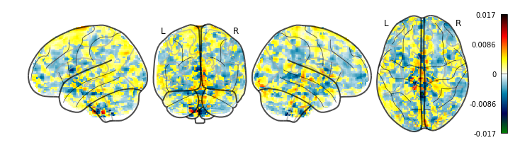

```{r setup, include=FALSE}
knitr::opts_chunk$set(echo = TRUE, message = FALSE, warning = FALSE, dpi = 300, colormodel = "cmyk")
options(scipen = 999)
```

This code reproduces the fMRI analyses reported in the following manuscript:

[Using neural signatures to predict health behavior change: A mindful distancing intervention to reduce alcohol consumption as a proof of concept]()

# load packages
```{r}
library(pacman)
pacman::p_load(tidyverse, brms, ggeffects, tidybayes, ROCR, caret, interactions, modelr, broom.mixed, performance, install = TRUE)
devtools::install_github("hadley/emo")
```

# define aesthetics
```{r}
palette = c("#e64626", "#1985a1", "#4c5c68", "#FAC748")
palette_group = c(palette[2], palette[4])

plot_aes = theme_minimal() +
  theme(legend.position = "top",
        legend.text = element_text(size = 16),
        plot.title = element_text(hjust = 0.5),
        text = element_text(size = 18, family = "Futura Medium"),
        panel.grid.major = element_blank(),
        panel.grid.minor = element_blank(),
        axis.text = element_text(color = "black"),
        axis.line = element_line(colour = "black"),
        axis.ticks.y = element_blank())
```

# define functions
```{r}
make_table = function(data) {
    data %>%
      broom.mixed::tidy(conf.int = TRUE, conf.level = 0.95) %>%
      filter(effect == "fixed") %>%
      mutate(term = gsub("\\(Intercept\\)", "intercept", term),
             term = gsub("trial_condregulation", "task condition (mindful distancing)", term),
             term = gsub("trial_cond_recode", "task condition (mindful distancing)", term),
             term = gsub("trial_condmindfuldistancing", "task condition (mindful distancing)", term),
             term = gsub("dot_between_std", "signature expression (between)", term),
             term = gsub("dot_within_std", "signature expression (within)", term),
             term = gsub("dot_sd", "signature expression variability", term),
             term = gsub("regulation_expression", "signature expression", term),
             term = gsub("confidence_rating", "confidence rating", term),
             term = gsub("MAAS_mean", "MAAS score", term),
             term = gsub(":", " x  ", term),
             `b [95% CI]` = sprintf("%.2f [%.2f, %.2f]", estimate, conf.low, conf.high),) %>%
      select(term, `b [95% CI]`) %>%
      knitr::kable(digits = 2)
}
```

# load data
```{r}
classifier_data = read.csv("../data/classifier_data.csv", stringsAsFactors = FALSE) %>%
  mutate(predicted_factor = as.factor(predicted_factor),
         actual_factor = as.factor(actual_factor))
ratings = read.csv("../data/ratings.csv", stringsAsFactors = FALSE)
maas = read.csv("../data/MAAS.csv", stringsAsFactors = FALSE)
merged = read.csv("../data/task_neuro_data.csv", stringsAsFactors = FALSE)
disaggregated = read.csv("../data/disaggregated_data.csv", stringsAsFactors = FALSE)
disaggregated_mindful = disaggregated %>%
  filter(condition == "mindful distancing")
```

# mindful distancing signature development analyses {.tabset}

Here is the weight map from the MVPA analyses:




## cross-validation accuracy {.tabset}

`r emo::ji("check")` We expect that we will be able to train a classifier at the run level to distinguish mindful distancing from uninstructed reactivity to alcohol cues with greater than chance accuracy decoding.

```{r}
caret::confusionMatrix(classifier_data$predicted_factor, classifier_data$actual_factor)
```

## trial-level accuracy {.tabset}
`r emo::ji("check")` Given that the classifier is developed at the run level, we will also confirm that the expression of the mindful distancing signature is evident at the trial-level. That is, we expect the signature expression to be higher during mindful distancing trials compared to reactivity trials.

### means {.tabset}
#### plot
```{r, fig.width=5, fig.height=4.5}
data_means = merged %>%
  filter(condition == "mindful distancing") %>%
  mutate(trial_cond = gsub("regulation", "mindful distancing", trial_cond),
         trial_cond = factor(trial_cond, levels = c("reactivity", "mindful distancing")),
         dot_std = scale(dot, center = TRUE, scale = TRUE))

data_means %>%
  ggplot(aes(trial_cond, dot, color = trial_cond, fill = trial_cond)) +
  stat_summary(fun.data = "mean_cl_boot", geom = "bar") +
  stat_summary(fun.data = "mean_cl_boot", geom = "errorbar", width = 0, color = "black") +
  scale_color_manual(name = "", values = palette) +
  scale_fill_manual(name = "", values = palette) +
  labs(x = "\ntrial type", y = "signature expression\n") +
  plot_aes +
  theme(legend.position = "none")
```

#### run model
```{r, cache = FALSE, echo = TRUE, results = "hide"}
prior = c(prior(normal(0, 1), class=b))

mod_means = brms::brm(dot_std ~ trial_cond + (1 + trial_cond | pID),
                      data = data_means, 
                      prior = prior,
                      control = list(adapt_delta = .9),
                      cores = 8, iter = 2000, silent = TRUE, seed = 6523)
```

#### table
```{r}
make_table(mod_means)
```

#### summary
```{r}
summary(mod_means, prob = .95)
```

### ROC plot
```{r, fig.width=5, fig.height=4.5}
acc_line1 = data.frame(x = c(0, 1), y = c(1, 1))
acc_line2 = data.frame(y = c(0, 1), x = c(0, 0))

merged %>%
  filter(condition %in% c("mindful distancing")) %>%
  filter(!is.na(dot)) %>%
  mutate(actual = ifelse(trial_cond == "regulation", 1, 0)) %>%
  group_by(condition) %>%
  do({
    condition = .$condition
    pred = prediction(.$dot, .$actual)
    perf = ROCR::performance(pred, measure = "tpr", x.measure = "fpr")
    data.frame(cut = perf@alpha.values[[1]],fpr = perf@x.values[[1]],tpr = perf@y.values[[1]])
  }) %>%
  ggplot(aes(fpr, tpr)) +
    geom_line(aes(color = condition), size = 1) +
    geom_abline(intercept = 0, slope = 1) +
    geom_line(data = acc_line1, aes(x, y)) +
    geom_line(data = acc_line2, aes(x, y)) +
    scale_color_manual(values = palette_group) +
    scale_x_continuous(breaks = seq(0, 1, .2)) +
    scale_y_continuous(breaks = seq(0, 1, .2)) +
    labs(x = "\nfalse positive rate (1 - specificity)", y = "true positive rate (sensitivity)\n") +
    plot_aes +
    theme(legend.position = "none",
          legend.spacing.y = unit(-.1, "cm"))
```

### confusion matrix
```{r}
conf_data = merged %>%
  filter(condition == "mindful distancing") %>%
  filter(!is.na(dot)) %>%
  mutate(predicted = ifelse(dot > 0, "regulation",
                     ifelse(dot < 0, "reactivity", NA)),
         predicted = as.factor(predicted),
         trial_cond = as.factor(as.character(trial_cond)))

caret::confusionMatrix(conf_data$predicted, conf_data$trial_cond)
```

# descriptive statistics
## craving {.tabset}
### stats
```{r}
disaggregated_mindful %>%
  group_by(trial_cond) %>%
  summarize(M = mean(resp, na.rm = TRUE),
          SD = sd(resp, na.rm = TRUE)) %>%
  knitr::kable(digits = 1, format = "pandoc")
```

### visualize {.tabset}
#### across participants
```{r}
disaggregated_mindful %>%
  ggplot(aes(resp, fill = trial_cond)) +
  geom_bar(position = position_dodge()) +
  scale_fill_manual(values = palette) +
  plot_aes
```

#### by participant
```{r, fig.width=12, fig.height=10}
disaggregated_mindful %>%
  ggplot(aes(resp, fill = trial_cond)) +
  geom_bar(position = position_dodge()) +
  facet_wrap(~pID) +
  scale_fill_manual(values = palette) +
  plot_aes
```

# efficacy: trial-level craving analyses {.tabset}
## H1 {.tabset}

`r emo::ji("check")` Compared to reactivity trials, mindful distancing trials will be associated with decreased craving 

### run model
```{r, cache = FALSE, echo = TRUE, results = "hide"}
mod_behavior = brms::brm(resp_std ~ 1 + trial_cond +
                (1 + trial_cond | pID) + (1 | stimulus),
                disaggregated_mindful,
                prior = prior,
                cores = 8, iter = 2000, silent = TRUE, seed = 6523)
```

### plot
```{r, fig.width=6, fig.height=5}
mod_behavior %>%
  spread_draws(b_Intercept, b_trial_condregulation) %>%
  mutate(reactivity = b_Intercept,
         mindfulness = b_Intercept + b_trial_condregulation) %>%
  gather(`trial type`, value, reactivity, mindfulness) %>%
  ggplot(aes(y = "", x = value, fill = `trial type`)) +
  stat_halfeye(alpha = .5) +
  scale_fill_manual(values = c(palette[2], palette[1])) +
  scale_y_discrete(expand = c(.1, .1)) +
  labs(x = "\npredicted craving rating\n", y = "") + 
  plot_aes
```

### table
```{r}
make_table(mod_behavior)
```

### summary
```{r}
summary(mod_behavior, prob = .95)
```

### ICC {.tabset}
#### participant
```{r}
performance::variance_decomposition(mod_behavior, re_formula = ~ (1 + trial_cond | pID))
```

#### stimulus
```{r}
performance::variance_decomposition(mod_behavior, re_formula = ~ (1 | stimulus))
```

## H2 {.tabset}

`r emo::ji("check")` A: We expect that people who have greater expression of the mindful distancing signature on average (i.e., L2, between-person expression) will also have lower craving ratings on a trial-by-trial basis.

`r emo::ji("x")` B: We expect that trials with greater expression of the mindful distancing signature compared to one’s average (i.e., L1, within-person expression) will be associated with lower craving ratings on a trial-by-trial basis.

### run model {.tabset}
```{r, cache = FALSE, echo = TRUE, results = "hide"}
mod_h2_int = brms::brm(resp_std ~ 1 + trial_cond * dot_between_std +
                         trial_cond * dot_within_std +
                         (1 + trial_cond * dot_within_std | pID) + (1 | stimulus),
                disaggregated_mindful,
                prior = prior,
                cores = 8, iter = 2000, silent = TRUE, seed = 6523)
```

### plots {.tabset}
#### between-person {.tabset}
```{r, fig.width=7, fig.height=5.5}
points_between = disaggregated_mindful %>%
  select(pID, resp_std, trial_cond, dot_between_std) %>%
  group_by(pID, trial_cond, dot_between_std) %>%
  summarize(resp_std = mean(resp_std, na.rm = TRUE)) %>%
  mutate(group = ifelse(trial_cond == "regulation", "mindful distancing", "reactivity"),
         group = factor(group, levels = c("reactivity", "mindful distancing")),
         type = "between-person") %>%
  rename("x" = dot_between_std) %>%
  ungroup() %>%
  select(pID, x, group)

vals = modelr::seq_range(points_between$x, n = 25)

predicted_sub = ggeffects::ggpredict(mod_h2_int, terms = c("pID", "trial_cond"), type = "random") %>%
  data.frame() %>%
  mutate(group = ifelse(group == "regulation", "mindful distancing", "reactivity"),
         group = factor(group, levels = c("reactivity", "mindful distancing"))) %>%
  rename("pID" = x) %>%
  left_join(., points_between)

predicted = ggeffects::ggpredict(mod_h2_int, c("dot_between_std [vals]", "trial_cond"), 
                                 ci.lvl = 0.95) %>%
  data.frame() %>%
  mutate(type = "between-person") %>%
  mutate(group = ifelse(group == "regulation", "mindful distancing", "reactivity"),
         group = factor(group, levels = c("reactivity", "mindful distancing")))

(between = predicted %>%
  ggplot(aes(x, predicted, color = group, fill = group)) +
  geom_point(data = predicted_sub, alpha = .4, size = 2) +
  geom_line(data = predicted_sub, aes(group = pID), alpha = .4, size = 1.25, color = "grey") +
  geom_ribbon(aes(ymin = conf.low, ymax = conf.high), alpha = .2, color = NA) +
  geom_line(size = 2) +
  scale_fill_manual(name = "trial type", values = palette) +
  scale_color_manual(name = "trial type", values = palette) +
  scale_y_continuous(breaks = c(-1,0,1)) +
  labs(x = "between-person signature expression (SD)",
       y = "craving rating (SD)\n",
       title = "between-person") +
  plot_aes +
  theme(legend.position = "top"))
```

#### within-person
```{r, fig.width=7, fig.height=5.5}
vals = modelr::seq_range(disaggregated_mindful$dot_within_std, n = 25)

predicted_sub = ggeffects::ggpredict(mod_h2_int, terms = c("dot_within_std [vals]", "trial_cond", "pID"), type = "random") %>%
  data.frame() %>%
  mutate(group = ifelse(group == "regulation", "mindful distancing", "reactivity"),
         group = factor(group, levels = c("reactivity", "mindful distancing")))

predicted = ggeffects::ggpredict(mod_h2_int, c("dot_within_std [vals]", "trial_cond"),
                                 ci.lvl = 0.95) %>%
  data.frame() %>%
  mutate(group = ifelse(group == "regulation", "mindful distancing", "reactivity"),
         group = factor(group, levels = c("reactivity", "mindful distancing")))

(within = predicted %>%
  ggplot(aes(x, predicted, color = group, fill = group)) +
  stat_smooth(data = predicted_sub, aes(group = interaction(facet, group)), 
              geom = "line", method = "lm", alpha = 0.15, se = FALSE, size = 1.25, fullrange = TRUE) + 
  geom_ribbon(aes(ymin = conf.low, ymax = conf.high), alpha = .3, color = NA) + 
  geom_line(size = 2) +
  scale_fill_manual(name = "trial type", values = palette) +
  scale_color_manual(name = "trial type", values = palette) +
  scale_y_continuous(breaks = c(-1,0,1)) +
  scale_x_continuous(breaks = c(-4,-2,0,2,4)) +
  labs(x = "within-person signature expression (SD)",
       y = "craving rating (SD)\n",
       title = "within-person") +
  plot_aes +
  theme(legend.position = "top"))
```

#### combined
```{r, fig.width=12.25, fig.height=5}
ggpubr::ggarrange(between, within, nrow = 1, common.legend = TRUE)
```

### table
```{r}
make_table(mod_h2_int)
```

### simple slopes
```{r}
emmeans::emtrends(mod_h2_int, ~ trial_cond, var="dot_between_std", level = 0.95) %>%
    data.frame() %>%
    mutate(`b [95% CI]` = sprintf("%.2f [%.2f, %.2f]", dot_between_std.trend, lower.HPD, upper.HPD),
           trial_cond = recode(trial_cond, "regulation" = "mindful distancing")) %>%
  select(trial_cond, `b [95% CI]`) %>%
      knitr::kable()

emmeans::emtrends(mod_h2_int, ~ trial_cond, var="dot_within_std", level = 0.95) %>%
    data.frame() %>%
    mutate(`b [95% CI]` = sprintf("%.2f [%.2f, %.2f]", dot_within_std.trend, lower.HPD, upper.HPD),
           trial_cond = recode(trial_cond, "regulation" = "mindful distancing")) %>%
  select(trial_cond, `b [95% CI]`) %>%
      knitr::kable()
```

### summary
```{r}
summary(mod_h2_int, prob = .95)
```

### ICC {.tabset}
#### participant
```{r}
performance::variance_decomposition(mod_h2_int, re_formula = ~ (1 + trial_cond * dot_within_std | pID))
```

#### stimulus
```{r}
performance::variance_decomposition(mod_h2_int, re_formula = ~ (1 | stimulus))
```

# sensitivity analyses
## mindful signature distancing: discriminant validity {.tabset}
> To examine discriminant validity, we will apply the mindful distancing signature to data from a separate group of participants who were instructed to use a different form of cognitive regulation (i.e., not mindful distancing) that is not expected to rely on the same brain regions. We expect lower than chance accuracy decoding alcohol regulation versus reactivity trials.

### ROC plot
```{r, fig.width=7, fig.height=6.5}
acc_line1 = data.frame(x = c(0, 1), y = c(1, 1))
acc_line2 = data.frame(y = c(0, 1), x = c(0, 0))

merged %>%
  filter(condition %in% c("perspective-taking", "mindful distancing")) %>%
  filter(!is.na(dot)) %>%
  mutate(actual = ifelse(trial_cond == "regulation", 1, 0)) %>%
  group_by(condition) %>%
  do({
    condition = .$condition
    pred = prediction(.$dot, .$actual)
    perf = ROCR::performance(pred, measure = "tpr", x.measure = "fpr")
    data.frame(cut = perf@alpha.values[[1]],fpr = perf@x.values[[1]],tpr = perf@y.values[[1]])
  }) %>%
  ggplot(aes(fpr, tpr)) +
    geom_line(aes(color = condition), size = 1) +
    geom_abline(intercept = 0, slope = 1) +
    geom_line(data = acc_line1, aes(x, y)) +
    geom_line(data = acc_line2, aes(x, y)) +
    scale_x_continuous(breaks = seq(0, 1, .2)) +
    scale_y_continuous(breaks = seq(0, 1, .2)) +
    scale_color_manual(name = "", values = palette_group) +
    labs(x = "\nfalse positive rate (1 - specificity)", y = "true positive rate (sensitivity)\n") +
    plot_aes +
    theme(legend.position = c(.75, .15),
        legend.spacing.y = unit(-.1, "cm"))
```

### confusion matrix
```{r}
conf_data = merged %>%
  filter(condition == "perspective-taking") %>%
  filter(!is.na(dot)) %>%
  mutate(predicted = ifelse(dot > 0, "regulation",
                     ifelse(dot < 0, "reactivity", NA)),
         predicted = as.factor(predicted),
         trial_cond = as.factor(as.character(trial_cond)))

caret::confusionMatrix(conf_data$predicted, conf_data$trial_cond)
```

## excluding participants who don't crave alcohol {.tabset}
> Trial-level craving analyses among participants who rated > 1 reactivity trial as craved (rating > 3)

```{r, fig.width=12, fig.height=10}
pids_craved = disaggregated_mindful %>%
  filter(trial_cond == "reactivity") %>%
  mutate(resp_bin = ifelse(resp > 3, "craved", "not craved")) %>%
  group_by(pID, resp_bin) %>%
  summarize(n = n()) %>%
  group_by(pID) %>%
  mutate(percent = round((n / sum(n)) * 100, 1)) %>%
  filter(resp_bin == "craved") %>%
  arrange(desc(percent)) %>%
  filter(n > 1)

disaggregated_mindful %>%
  filter(trial_cond == "reactivity") %>%
  mutate(included = ifelse(pID %in% pids_craved$pID, "yes", "no")) %>%
  ggplot(aes(resp, fill = trial_cond, alpha = included)) +
  geom_bar(position = position_dodge()) +
  facet_wrap(~pID) +
  scale_fill_manual(values = palette, guide = FALSE) +
  labs(x = "craving rating") +
  plot_aes
```

### H1 {.tabset}

`r emo::ji("check")` Compared to reactivity trials, mindful distancing trials will be associated with decreased craving 

#### run model
```{r, cache = FALSE, echo = TRUE, results = "hide"}
mod_behavior = brms::brm(resp_std ~ 1 + trial_cond +
                (1 + trial_cond | pID) + (1 | stimulus),
                filter(disaggregated_mindful, pID %in% pids_craved$pID),
                prior = prior,
                cores = 8, iter = 2000, silent = TRUE, seed = 6523)
```

#### plot
```{r, fig.width=6, fig.height=5}
mod_behavior %>%
  spread_draws(b_Intercept, b_trial_condregulation) %>%
  mutate(reactivity = b_Intercept,
         mindfulness = b_Intercept + b_trial_condregulation) %>%
  gather(`trial type`, value, reactivity, mindfulness) %>%
  ggplot(aes(y = "", x = value, fill = `trial type`)) +
  stat_halfeye(alpha = .5) +
  scale_fill_manual(values = c(palette[2], palette[1])) +
  scale_y_discrete(expand = c(.1, .1)) +
  coord_cartesian(xlim = c(1, 5)) +
  labs(x = "\npredicted craving rating\n", y = "") + 
  plot_aes
```

#### table
```{r}
make_table(mod_behavior)
```

#### summary
```{r}
summary(mod_behavior, prob = .95)
```

#### ICC {.tabset}
##### participant
```{r}
performance::variance_decomposition(mod_behavior, re_formula = ~ (1 + trial_cond | pID))
```

##### stimulus
```{r}
performance::variance_decomposition(mod_behavior, re_formula = ~ (1 | stimulus))
```

### H2 {.tabset}

`r emo::ji("check")` A: We expect that people who have greater expression of the mindful distancing signature on average (i.e., L2, between-person expression) will also have lower craving ratings on a trial-by-trial basis.

`r emo::ji("x")` B: We expect that trials with greater expression of the mindful distancing signature compared to one’s average (i.e., L1, within-person expression) will be associated with lower craving ratings on a trial-by-trial basis.

#### run model {.tabset}
```{r, cache = FALSE, echo = TRUE, results = "hide"}
mod_h2_int = brms::brm(resp_std ~ 1 + trial_cond * dot_between_std +
                         trial_cond * dot_within_std +
                         (1 + trial_cond * dot_within_std | pID) + (1 | stimulus),
                filter(disaggregated_mindful, pID %in% pids_craved$pID),
                prior = prior,
                cores = 8, iter = 2000, silent = TRUE, seed = 6523)
```

#### plots {.tabset}
##### between-person {.tabset}
```{r, fig.width=7, fig.height=5.5}
points_between = disaggregated_mindful %>%
  select(pID, resp_std, trial_cond, dot_between_std) %>%
  group_by(pID, trial_cond, dot_between_std) %>%
  summarize(resp_std = mean(resp_std, na.rm = TRUE)) %>%
  mutate(group = ifelse(trial_cond == "regulation", "mindful distancing", "reactivity"),
         group = factor(group, levels = c("reactivity", "mindful distancing")),
         type = "between-person") %>%
  rename("x" = dot_between_std) %>%
  ungroup() %>%
  select(pID, x, group)

vals = modelr::seq_range(points_between$x, n = 25)

predicted_sub = ggeffects::ggpredict(mod_h2_int, terms = c("pID", "trial_cond"), type = "random") %>%
  data.frame() %>%
  mutate(group = ifelse(group == "regulation", "mindful distancing", "reactivity"),
         group = factor(group, levels = c("reactivity", "mindful distancing"))) %>%
  rename("pID" = x) %>%
  left_join(., points_between)

predicted = ggeffects::ggpredict(mod_h2_int, c("dot_between_std [vals]", "trial_cond"), 
                                 ci.lvl = 0.95) %>%
  data.frame() %>%
  mutate(type = "between-person") %>%
  mutate(group = ifelse(group == "regulation", "mindful distancing", "reactivity"),
         group = factor(group, levels = c("reactivity", "mindful distancing")))

(between = predicted %>%
  ggplot(aes(x, predicted, color = group, fill = group)) +
  geom_point(data = predicted_sub, alpha = .4, size = 2) +
  geom_line(data = predicted_sub, aes(group = pID), alpha = .4, size = 1.25, color = "grey") +
  geom_ribbon(aes(ymin = conf.low, ymax = conf.high), alpha = .2, color = NA) +
  geom_line(size = 2) +
  scale_fill_manual(name = "trial type", values = palette) +
  scale_color_manual(name = "trial type", values = palette) +
  scale_y_continuous(breaks = c(1,2,3)) +
  labs(x = "between-person signature expression (SD)",
       y = "craving rating (SD)\n",
       title = "between-person") +
  plot_aes +
  theme(legend.position = "top"))
```

##### within-person
```{r, fig.width=7, fig.height=5.5}
vals = modelr::seq_range(disaggregated_mindful$dot_within_std, n = 25)

predicted_sub = ggeffects::ggpredict(mod_h2_int, terms = c("dot_within_std [vals]", "trial_cond", "pID"), type = "random") %>%
  data.frame() %>%
  mutate(group = ifelse(group == "regulation", "mindful distancing", "reactivity"),
         group = factor(group, levels = c("reactivity", "mindful distancing")))

predicted = ggeffects::ggpredict(mod_h2_int, c("dot_within_std [vals]", "trial_cond"),
                                 ci.lvl = 0.95) %>%
  data.frame() %>%
  mutate(group = ifelse(group == "regulation", "mindful distancing", "reactivity"),
         group = factor(group, levels = c("reactivity", "mindful distancing")))

(within = predicted %>%
  ggplot(aes(x, predicted, color = group, fill = group)) +
  stat_smooth(data = predicted_sub, aes(group = interaction(facet, group)), geom = "line", method = "lm", alpha = 0.15, se = FALSE, size = 1.25, fullrange = TRUE) + 
  geom_ribbon(aes(ymin = conf.low, ymax = conf.high), alpha = .3, color = NA) + 
  geom_line(size = 2) +
  scale_fill_manual(name = "trial type", values = palette) +
  scale_color_manual(name = "trial type", values = palette) +
  labs(x = "within-person signature expression (SD)",
       y = "craving rating (SD)\n",
       title = "within-person") +
  plot_aes +
  theme(legend.position = "top"))
```

##### combined
```{r, fig.width=12.25, fig.height=5}
ggpubr::ggarrange(between, within, nrow = 1, common.legend = TRUE)
```

#### table
```{r}
make_table(mod_h2_int)
```

#### simple slopes
```{r}
emmeans::emtrends(mod_h2_int, ~ trial_cond, var="dot_between_std", level = 0.95) %>%
    data.frame() %>%
    mutate(`b [95% CI]` = sprintf("%.2f [%.2f, %.2f]", dot_between_std.trend, lower.HPD, upper.HPD),
           trial_cond = recode(trial_cond, "regulation" = "mindful distancing")) %>%
  select(trial_cond, `b [95% CI]`) %>%
      knitr::kable()

emmeans::emtrends(mod_h2_int, ~ trial_cond, var="dot_within_std", level = 0.95) %>%
    data.frame() %>%
    mutate(`b [95% CI]` = sprintf("%.2f [%.2f, %.2f]", dot_within_std.trend, lower.HPD, upper.HPD),
           trial_cond = recode(trial_cond, "regulation" = "mindful distancing")) %>%
  select(trial_cond, `b [95% CI]`) %>%
      knitr::kable()
```

#### summary
```{r}
summary(mod_h2_int, prob = .95)
```

#### ICC {.tabset}
##### participant
```{r}
performance::variance_decomposition(mod_h2_int, re_formula = ~ (1 + trial_cond * dot_within_std | pID))
```

##### stimulus
```{r}
performance::variance_decomposition(mod_h2_int, re_formula = ~ (1 | stimulus))
```

## confidence rating analyses {.tabset}
```{r}
merged_ratings = disaggregated_mindful %>%
  left_join(., ratings) %>%
  left_join(., maas)
```

### correlation between confidence and signature expression 
```{r}
corr_data = disaggregated_mindful %>%
  filter(trial_cond == "regulation") %>%
  select(pID, dot_between) %>%
  unique() %>%
  left_join(., ratings)

cor.test(corr_data$confidence_rating, corr_data$dot_between)
```

### signature expression ~ confidence ratings {.tabset}
> We examined the degree to which confidence ratings were associated with neural signature expression

#### run model
```{r, cache = FALSE, echo = TRUE, results = "hide"}
mod_ph_expression = brms::brm(dot ~ confidence_rating * trial_cond + (1 + trial_cond | pID),
                           data = merged_ratings,
                           prior = prior,
                           cores = 8, iter = 2000, silent = TRUE, seed = 6523)
```

#### plot
```{r}
ggeffects::ggpredict(mod_ph_expression, terms = c("confidence_rating", "trial_cond"),
                     ci.lvl = 0.95) %>%
  data.frame() %>%
  mutate(group = ifelse(group == "regulation", "mindful distancing", "reactivity"),
         group = factor(group, levels = c("reactivity", "mindful distancing"))) %>%
  ggplot(aes(x, predicted, color = group, fill = group)) +
  geom_ribbon(aes(ymin = conf.low, ymax = conf.high), alpha = .2, color = NA) +
  geom_line(size = 2) +
  scale_fill_manual(name = "trial type", values = palette) +
  scale_color_manual(name = "trial type", values = palette) +
  labs(x = "instruction confidence rating (SD)",
       y = "signature expression\n") +
  plot_aes +
  theme(legend.position = "top")
```

#### table
```{r}
make_table(mod_ph_expression)
```

#### simple slopes
```{r}
emmeans::emtrends(mod_ph_expression, ~ trial_cond, var="confidence_rating", level = .95) %>%
    data.frame() %>%
    mutate(`b [95% CI]` = sprintf("%.2f [%.2f, %.2f]", confidence_rating.trend, lower.HPD, upper.HPD),
           trial_cond = recode(trial_cond, "regulation" = "mindful distancing")) %>%
  select(trial_cond, `b [95% CI]`) %>%
      knitr::kable()
```

#### summary
```{r}
summary(mod_ph_expression, prob = .95)
```

### H2 controlling for confidence ratings {.tabset}
> We examined the degree to which controlling for confidence ratings affected the results for H2

#### run model {.tabset}
```{r, cache = FALSE, echo = TRUE, results = "hide"}
mod_ph_h2 = brms::brm(resp_std ~ 1 + trial_cond * dot_between_std +
                        trial_cond * dot_within_std +
                        trial_cond * confidence_rating +
                        (1 + trial_cond * dot_within_std | pID) + (1 | stimulus),
                      data = merged_ratings,
                      prior = prior,
                      cores = 8, iter = 2000, silent = TRUE, seed = 6523)
```

#### plots {.tabset}
##### between-person {.tabset}
```{r, fig.width=7, fig.height=5.5}
points_between = disaggregated_mindful %>%
  select(pID, resp_std, trial_cond, dot_between_std) %>%
  group_by(pID, trial_cond, dot_between_std) %>%
  summarize(resp_std = mean(resp_std, na.rm = TRUE)) %>%
  mutate(group = ifelse(trial_cond == "regulation", "mindful distancing", "reactivity"),
         group = factor(group, levels = c("reactivity", "mindful distancing")),
         type = "between-person") %>%
  rename("x" = dot_between_std) %>%
  ungroup() %>%
  select(pID, x, group)

vals = modelr::seq_range(points_between$x, n = 25)

predicted_sub = ggeffects::ggpredict(mod_h2_int, terms = c("pID", "trial_cond"), type = "random") %>%
  data.frame() %>%
  mutate(group = ifelse(group == "regulation", "mindful distancing", "reactivity"),
         group = factor(group, levels = c("reactivity", "mindful distancing"))) %>%
  rename("pID" = x) %>%
  left_join(., points_between)

predicted = ggeffects::ggpredict(mod_h2_int, c("dot_between_std [vals]", "trial_cond"), 
                                 ci.lvl = 0.95) %>%
  data.frame() %>%
  mutate(type = "between-person") %>%
  mutate(group = ifelse(group == "regulation", "mindful distancing", "reactivity"),
         group = factor(group, levels = c("reactivity", "mindful distancing")))

(between = predicted %>%
  ggplot(aes(x, predicted, color = group, fill = group)) +
  geom_point(data = predicted_sub, alpha = .4, size = 2) +
  geom_line(data = predicted_sub, aes(group = pID), alpha = .4, size = 1.25, color = "grey") +
  geom_ribbon(aes(ymin = conf.low, ymax = conf.high), alpha = .2, color = NA) +
  geom_line(size = 2) +
  scale_fill_manual(name = "trial type", values = palette) +
  scale_color_manual(name = "trial type", values = palette) +
  scale_y_continuous(breaks = c(1,2,3)) +
  labs(x = "between-person signature expression (SD)",
       y = "craving rating (SD)\n",
       title = "between-person") +
  plot_aes +
  theme(legend.position = "top"))
```

##### within-person only
```{r, fig.width=7, fig.height=5.5}
vals = modelr::seq_range(disaggregated_mindful$dot_within_std, n = 25)

predicted_sub = ggeffects::ggpredict(mod_h2_int, terms = c("dot_within_std [vals]", "trial_cond", "pID"), type = "random") %>%
  data.frame() %>%
  mutate(group = ifelse(group == "regulation", "mindful distancing", "reactivity"),
         group = factor(group, levels = c("reactivity", "mindful distancing")))

predicted = ggeffects::ggpredict(mod_h2_int, c("dot_within_std [vals]", "trial_cond"),
                                 ci.lvl = 0.95) %>%
  data.frame() %>%
  mutate(group = ifelse(group == "regulation", "mindful distancing", "reactivity"),
         group = factor(group, levels = c("reactivity", "mindful distancing")))

(within = predicted %>%
  ggplot(aes(x, predicted, color = group, fill = group)) +
  stat_smooth(data = predicted_sub, aes(group = interaction(facet, group)), geom = "line", method = "lm", alpha = 0.15, se = FALSE, size = 1.25, fullrange = TRUE) + 
  geom_ribbon(aes(ymin = conf.low, ymax = conf.high), alpha = .3, color = NA) + 
  geom_line(size = 2) +
  scale_fill_manual(name = "trial type", values = palette) +
  scale_color_manual(name = "trial type", values = palette) +
  labs(x = "within-person signature expression (SD)",
       y = "craving rating (SD)\n",
       title = "within-person") +
  plot_aes +
  theme(legend.position = "top"))
```

#### table
```{r}
make_table(mod_ph_h2)
```

#### simple slopes {.tabset}
##### signature expression
```{r}
emmeans::emtrends(mod_ph_h2, ~ trial_cond, var="dot_between_std", level = .95) %>%
    data.frame() %>%
    mutate(`b [95% CI]` = sprintf("%.2f [%.2f, %.2f]", dot_between_std.trend, lower.HPD, upper.HPD),
           trial_cond = recode(trial_cond, "regulation" = "mindful distancing")) %>%
  select(trial_cond, `b [95% CI]`) %>%
      knitr::kable()

emmeans::emtrends(mod_ph_h2, ~ trial_cond, var="dot_within_std", level = .95) %>%
    data.frame() %>%
    mutate(`b [95% CI]` = sprintf("%.2f [%.2f, %.2f]", dot_within_std.trend, lower.HPD, upper.HPD),
           trial_cond = recode(trial_cond, "regulation" = "mindful distancing")) %>%
  select(trial_cond, `b [95% CI]`) %>%
      knitr::kable()
```

##### confidence ratings
```{r}
emmeans::emtrends(mod_ph_h2, ~ trial_cond, var="confidence_rating", level = .95) %>%
    data.frame() %>%
    mutate(`b [95% CI]` = sprintf("%.2f [%.2f, %.2f]", confidence_rating.trend, lower.HPD, upper.HPD),
           trial_cond = recode(trial_cond, "regulation" = "mindful distancing")) %>%
  select(trial_cond, `b [95% CI]`) %>%
      knitr::kable()
```

#### summary
```{r}
summary(mod_ph_h2, prob = .9)
```

#### compare posterior distributions
Compare preregistered model with the modeling controlling for confidence ratings

```{r}
posterior = posterior_samples(mod_h2_int) %>%
  transmute(`mindful distancing`= b_dot_between_std + `b_trial_condregulation:dot_between_std`,
            reactivity = b_dot_between_std) %>%
  gather(`trial type`, value) %>%
  mutate(model = "original model") %>%
  bind_rows(posterior_samples(mod_ph_h2) %>%
              transmute(`mindful distancing`= b_dot_between_std + `b_trial_condregulation:dot_between_std`,
                        reactivity = b_dot_between_std) %>%
              gather(`trial type`, value) %>%
              mutate(model = "controlling for confidence")) %>% 
  mutate(model = factor(model, levels = c("original model", "controlling for confidence")))

posterior %>%
  ggplot(aes(y = "", x = value, fill = model)) +
  stat_halfeye(alpha = .5) +
  scale_fill_manual(values = palette_group) +
  facet_grid(~`trial type`) +
  scale_y_discrete(expand = c(.1, .1)) +
  labs(x = "\nregression coefficient\n", y = "") + 
  plot_aes
```

## Mindful distancing and Awareness (MAAS) analyses {.tabset}
```{r}
merged_ratings = disaggregated_mindful %>%
  left_join(., maas)
```

### correlation between MAAS and signature expression 
```{r}
corr_data = disaggregated_mindful %>%
  filter(trial_cond == "regulation") %>%
  select(pID, dot_between) %>%
  unique() %>%
  left_join(., maas)

cor.test(corr_data$MAAS_mean, corr_data$dot_between)
```

### signature expression ~ MAAS scores {.tabset}
> We examined the degree to which MAAS scores were associated with neural signature expression

#### run model
```{r, cache = FALSE, echo = TRUE, results = "hide"}
mod_ph_expression = brms::brm(dot ~ MAAS_mean * trial_cond + (1 + trial_cond | pID),
                           data = merged_ratings,
                           prior = prior,
                           cores = 8, iter = 2000, silent = TRUE, seed = 6523)
```

#### plot
```{r}
ggeffects::ggpredict(mod_ph_expression, terms = c("MAAS_mean", "trial_cond"),
                     ci.lvl = 0.9) %>%
  data.frame() %>%
  mutate(group = ifelse(group == "regulation", "mindful distancing", "reactivity"),
         group = factor(group, levels = c("reactivity", "mindful distancing"))) %>%
  ggplot(aes(x, predicted, color = group, fill = group)) +
  geom_ribbon(aes(ymin = conf.low, ymax = conf.high), alpha = .2, color = NA) +
  geom_line(size = 2) +
  scale_fill_manual(name = "trial type", values = palette) +
  scale_color_manual(name = "trial type", values = palette) +
  labs(x = "MAAS score (SD)",
       y = "signature expression\n") +
  plot_aes +
  theme(legend.position = "top")
```

#### table
```{r}
make_table(mod_ph_expression)
```

#### simple slopes
```{r}
emmeans::emtrends(mod_ph_expression, ~ trial_cond, var="MAAS_mean", level = .9) %>%
    data.frame() %>%
    mutate(`b [95% CI]` = sprintf("%.2f [%.2f, %.2f]", MAAS_mean.trend, lower.HPD, upper.HPD),
           trial_cond = recode(trial_cond, "regulation" = "mindful distancing")) %>%
  select(trial_cond, `b [95% CI]`) %>%
      knitr::kable()
```

#### summary
```{r}
summary(mod_ph_expression, prob = .9)
```

### H2 controlling for MAAS scores {.tabset}
> We examined the degree to which controlling for MAAS scores affected the results for H2

#### run model {.tabset}
```{r, cache = FALSE, echo = TRUE, results = "hide"}
mod_ph_h2 = brms::brm(resp_std ~ 1 + trial_cond * dot_between_std +
                        trial_cond * dot_within_std + 
                        trial_cond * MAAS_mean +
                        (1 + trial_cond * dot_within_std | pID) + (1 | stimulus),
                      data = merged_ratings,
                      prior = prior,
                      cores = 8, iter = 2000, silent = TRUE, seed = 6523)
```

#### plots {.tabset}
##### between-person {.tabset}
```{r, fig.width=7, fig.height=5.5}
points_between = disaggregated_mindful %>%
  select(pID, resp_std, trial_cond, dot_between_std) %>%
  group_by(pID, trial_cond, dot_between_std) %>%
  summarize(resp_std = mean(resp_std, na.rm = TRUE)) %>%
  mutate(group = ifelse(trial_cond == "regulation", "mindful distancing", "reactivity"),
         group = factor(group, levels = c("reactivity", "mindful distancing")),
         type = "between-person") %>%
  rename("x" = dot_between_std) %>%
  ungroup() %>%
  select(pID, x, group)

vals = modelr::seq_range(points_between$x, n = 25)

predicted_sub = ggeffects::ggpredict(mod_h2_int, terms = c("pID", "trial_cond"), type = "random") %>%
  data.frame() %>%
  mutate(group = ifelse(group == "regulation", "mindful distancing", "reactivity"),
         group = factor(group, levels = c("reactivity", "mindful distancing"))) %>%
  rename("pID" = x) %>%
  left_join(., points_between)

predicted = ggeffects::ggpredict(mod_h2_int, c("dot_between_std [vals]", "trial_cond"), 
                                 ci.lvl = 0.95) %>%
  data.frame() %>%
  mutate(type = "between-person") %>%
  mutate(group = ifelse(group == "regulation", "mindful distancing", "reactivity"),
         group = factor(group, levels = c("reactivity", "mindful distancing")))

(between = predicted %>%
  ggplot(aes(x, predicted, color = group, fill = group)) +
  geom_point(data = predicted_sub, alpha = .4, size = 2) +
  geom_line(data = predicted_sub, aes(group = pID), alpha = .4, size = 1.25, color = "grey") +
  geom_ribbon(aes(ymin = conf.low, ymax = conf.high), alpha = .2, color = NA) +
  geom_line(size = 2) +
  scale_fill_manual(name = "trial type", values = palette) +
  scale_color_manual(name = "trial type", values = palette) +
  scale_y_continuous(breaks = c(1,2,3)) +
  labs(x = "between-person signature expression (SD)",
       y = "craving rating (SD)\n",
       title = "between-person") +
  plot_aes +
  theme(legend.position = "top"))
```

##### within-person only
```{r, fig.width=7, fig.height=5.5}
vals = modelr::seq_range(disaggregated_mindful$dot_within_std, n = 25)

predicted_sub = ggeffects::ggpredict(mod_h2_int, terms = c("dot_within_std [vals]", "trial_cond", "pID"), type = "random") %>%
  data.frame() %>%
  mutate(group = ifelse(group == "regulation", "mindful distancing", "reactivity"),
         group = factor(group, levels = c("reactivity", "mindful distancing")))

predicted = ggeffects::ggpredict(mod_h2_int, c("dot_within_std [vals]", "trial_cond"),
                                 ci.lvl = 0.95) %>%
  data.frame() %>%
  mutate(group = ifelse(group == "regulation", "mindful distancing", "reactivity"),
         group = factor(group, levels = c("reactivity", "mindful distancing")))

(within = predicted %>%
  ggplot(aes(x, predicted, color = group, fill = group)) +
  stat_smooth(data = predicted_sub, aes(group = interaction(facet, group)), geom = "line", method = "lm", alpha = 0.15, se = FALSE, size = 1.25, fullrange = TRUE) + 
  geom_ribbon(aes(ymin = conf.low, ymax = conf.high), alpha = .3, color = NA) + 
  geom_line(size = 2) +
  scale_fill_manual(name = "trial type", values = palette) +
  scale_color_manual(name = "trial type", values = palette) +
  labs(x = "within-person signature expression (SD)",
       y = "craving rating (SD)\n",
       title = "within-person") +
  plot_aes +
  theme(legend.position = "top"))
```

#### table
```{r}
make_table(mod_ph_h2)
```

#### simple slopes {.tabset}
##### signature expression
```{r}
emmeans::emtrends(mod_ph_h2, ~ trial_cond, var="dot_between_std", level = .9) %>%
    data.frame() %>%
    mutate(`b [95% CI]` = sprintf("%.2f [%.2f, %.2f]", dot_between_std.trend, lower.HPD, upper.HPD),
           trial_cond = recode(trial_cond, "regulation" = "mindful distancing")) %>%
  select(trial_cond, `b [95% CI]`) %>%
      knitr::kable()

emmeans::emtrends(mod_ph_h2, ~ trial_cond, var="dot_within_std", level = .9) %>%
    data.frame() %>%
    mutate(`b [95% CI]` = sprintf("%.2f [%.2f, %.2f]", dot_within_std.trend, lower.HPD, upper.HPD),
           trial_cond = recode(trial_cond, "regulation" = "mindful distancing")) %>%
  select(trial_cond, `b [95% CI]`) %>%
      knitr::kable()
```

##### MAAS score
```{r}
emmeans::emtrends(mod_ph_h2, ~ trial_cond, var="MAAS_mean", level = .9) %>%
    data.frame() %>%
    mutate(`b [95% CI]` = sprintf("%.2f [%.2f, %.2f]", MAAS_mean.trend, lower.HPD, upper.HPD),
           trial_cond = recode(trial_cond, "regulation" = "mindful distancing")) %>%
  select(trial_cond, `b [95% CI]`) %>%
      knitr::kable()
```

#### summary
```{r}
summary(mod_ph_h2, prob = .9)
```

#### compare posterior distributions
Compare preregistered model with the modeling controlling for MAAS scores

```{r}
posterior = posterior_samples(mod_h2_int) %>%
  transmute(`mindful distancing`= b_dot_between_std + `b_trial_condregulation:dot_between_std`,
            reactivity = b_dot_between_std) %>%
  gather(`trial type`, value) %>%
  mutate(model = "original model") %>%
  bind_rows(posterior_samples(mod_ph_h2) %>%
              transmute(`mindful distancing`= b_dot_between_std + `b_trial_condregulation:dot_between_std`,
                        reactivity = b_dot_between_std) %>%
              gather(`trial type`, value) %>%
              mutate(model = "controlling for MAAS")) %>% 
  mutate(model = factor(model, levels = c("original model", "controlling for MAAS")))

posterior %>%
  ggplot(aes(y = "", x = value, fill = model)) +
  stat_halfeye(alpha = .5) +
  scale_fill_manual(values = palette_group) +
  facet_grid(~`trial type`) +
  scale_y_discrete(expand = c(.1, .1)) +
  labs(x = "\nregression coefficient\n", y = "") + 
  plot_aes
```
